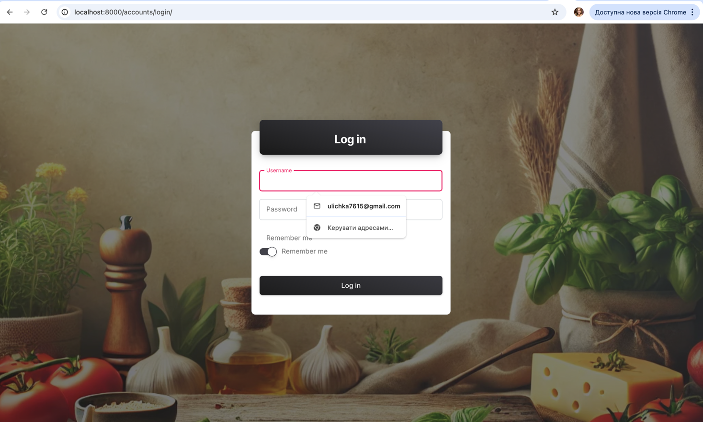
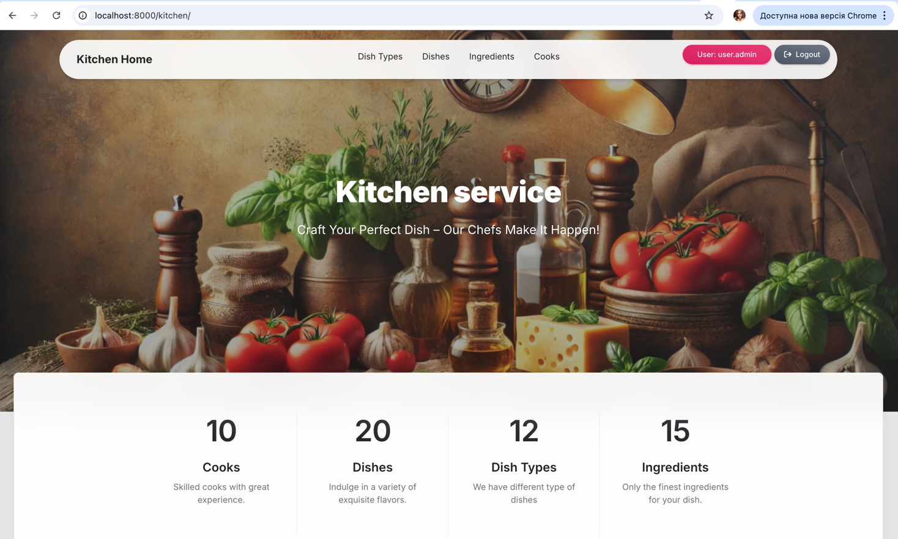
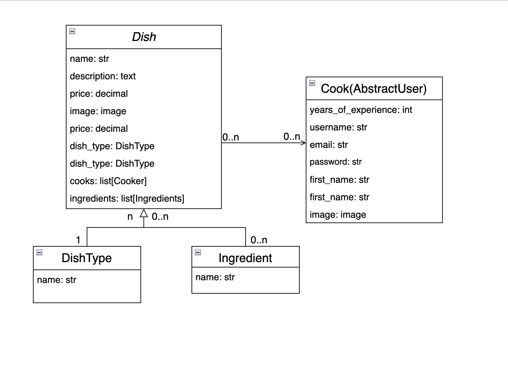

# Kitchen Service

**Kitchen Service**  is a web application designed for managing restaurant 
menus and
kitchen staff. It allows administrators and chefs to efficiently oversee dishes,
ingredients, dish types, and cooks.

## Features
+ **User Registration and Authentication:** 
Secure user accounts with login and "Remember Me" functionality.
+ **Dish Type Management:** Add, edit, and delete dish categories.
+ **Dish Management:** Add new dishes with descriptions, prices, images, dish 
types, and ingredient lists.
+ **Cook Management:** Register cooks, assign them to dishes, and track their 
  years of experience and personal details.
+ **Ingredient Management:** Add new ingredients and link them to dishes.
+ **Search:** Search user by username, dish, dish type and ingredient 
  by name.
+ **Responsive Design:** Fully functional on both desktop and mobile devices.

## Technologies Used
+ **Backend:** Python, Django
+ **Frontend:** HTML5, CSS3, JavaScript
+ **Database:** SQLite3

## Installation
### Prerequisites
1. Python 3.8 or higher
2. SQLite3

## Setup
1. Clone the repository:
```
git clone https://github.com/juliazelena/kitchen-service.git
```
2. Create a virtual environment and install dependencies:
```
python -m venv venv
source venv/bin/activate  # For Windows: venv\Scripts\activate
pip install -r requirements.txt
```
3. Set up the database:
```
python manage.py makemigrations
python manage.py migrate
```
4. Create a superuser for admin access:
```
python manage.py createsuperuser
```
5. Run the development server:
```
python manage.py runserver
```
6. Open your browser and navigate to http://127.0.0.1:8000.

## Usage
+ Ask existing user to create your account and log in with your credentials.
+ Username: user.admin
+ Password: 1qazcde3

## Live Demo
Try the live demo: [Visit Kitchen Service](http://localhost:8000/kitchen/)

## Screenshots



## DB-structure

